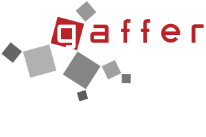

# Gaffer #

Gaffer is a VFX application that enables look developers, lighters, and compositors to easily build, tweak, iterate, and render scenes. Gaffer supports in-application scripting in Python and [OSL](https://github.com/imageworks/OpenShadingLanguage), so VFX artists and technical directors can design shaders, automate processes, and build production workflows.

An open-source project, Gaffer also provides an application framework for studios to design and create their own VFX production pipeline tools. Built using the [Cortex](https://github.com/ImageEngine/cortex) libraries, Gaffer ships with a multi-threaded, deferred evaluation engine and a flexible user interface framework.

More information about Gaffer and its use in studios can be found at [GafferHQ](https://gafferhq.org).

Users can learn how to use Gaffer through the [documentation](https://gafferhq.org/documentation).

Developer notes are available on the [Gaffer developer wiki](https://github.com/GafferHQ/gaffer/wiki).

Participating in the Gaffer community requires abiding by the project's [Code of Conduct](CODE_OF_CONDUCT.md).


## Download ##

Compiled binary releases are available for download from the [releases page](https://github.com/GafferHQ/gaffer/releases).

Gaffer is officially supported and tested on **Linux** (CentOS 7) and **macOS** (macOS 10.14).


## Building ##

[](https://github.com/GafferHQ/gaffer/actions?query=workflow%3ACI)

Gaffer targets the [VFX Reference Platform](https://vfxplatform.com). We are currently on **CY2022**. Aside from general platform development packages, we specifically require the following tools that may not be installed by default on your system. Without these, you will not be able to build Gaffer.

> **Note:** From time to time, this list may change. For a complete, accurate, and up-to-date method of installing the prerequisites on CentOS, refer to the [Docker setup](https://github.com/GafferHQ/build/blob/master/Dockerfile) we use for building automatic releases.

### Build requirements ###


> **Note:** Specific package names may differ depending on your Linux distribution and repository.

#### Main build requirements ####


Package Name | Version
------------ |:--------------:
[`gcc`](https://gcc.gnu.org/index.html) | 6.3.1
[`scons`](http://www.scons.org) |
[`inkscape`](http://inkscape.org) |


#### Documentation build requirements ####

> **Note:** Building the documentation is optional.

Package Name | Minimum Version
------------ |:--------------:
[`sphinx`](http://www.sphinx-doc.org/) | 1.8

Python Module | Required version
------------- |:---------------:
`sphinx_rtd_theme` | 0.4.3
`recommonmark` | 0.5.0
`docutils` | 0.12


### Build process ###

```bash
git clone https://github.com/GafferHQ/gaffer.git
cd gaffer
```

Gaffer depends on a number of 3rd-party libraries. We recommend using the pre-built dependencies from the [Gaffer dependencies project](https://github.com/GafferHQ/dependencies/releases). These are used in our automated test builds and so are guaranteed to be up-to-date with Gaffer's requirements.

The dependencies distribution forms the basis of a Gaffer build and the root of the expanded archive becomes the `BUILD_DIRECTORY` we pass to `scons`.

The easiest way to get the right dependencies version is to use the `config/installDependencies.sh` script included in the Gaffer source tree. This downloads the correct version for the version of Gaffer you are building and unpacks them to a directory of your choice.

In this example we're going to build gaffer to a `gaffer-build` directory next to our checkout.


```bash
./config/installDependencies.sh ../gaffer-build
```

You can then build Gaffer itself:

```bash
scons build BUILD_DIR=../gaffer-build
```

> **Note:** If `scons` has any issues finding dependencies or tools, see `SConstruct` for the various options that can be set to specify their location.

With any luck, you now have a functioning version of Gaffer.

```bash
../gaffer-build/bin/gaffer
```

### Building with third-party renderer support

Gaffer dependencies ships with Appleseed, but to build the modules for one of the other supported third-party renderers, you will need to set appropriate `scons` options pointing to your installation. The options are:

- Arnold: `ARNOLD_ROOT`
- 3Delight: `DELIGHT_ROOT`

For example, the following command builds Gaffer with Arnold support:

```bash
scons build ARNOLD_ROOT=/path/to/arnold/6 BUILD_DIR=...
````

## Questions and troubleshooting ##

If you have any questions about using Gaffer, or encounter problems setting it up, feel free to ask on the [Gaffer community group](https://groups.google.com/forum/#!forum/gaffer-dev). Our users and contributors are happy to help.


## Requesting features ##

If there is a feature you would like to see in Gaffer, request it on the [Gaffer community group](https://groups.google.com/forum/#!forum/gaffer-dev). Do not create an Issue for it on GitHub.


## Contributions and bugs reports ##

Please see the project's [contribution guidelines](CONTRIBUTING.md).


## Copyright and license ##

© 2011–2020 John Haddon. All rights reserved.

© 2011–2020 Image Engine Design Inc. All rights reserved.

© 2011–2020 Cinesite VFX Ltd. All rights reserved.

Distributed under the [BSD license](LICENSE).
